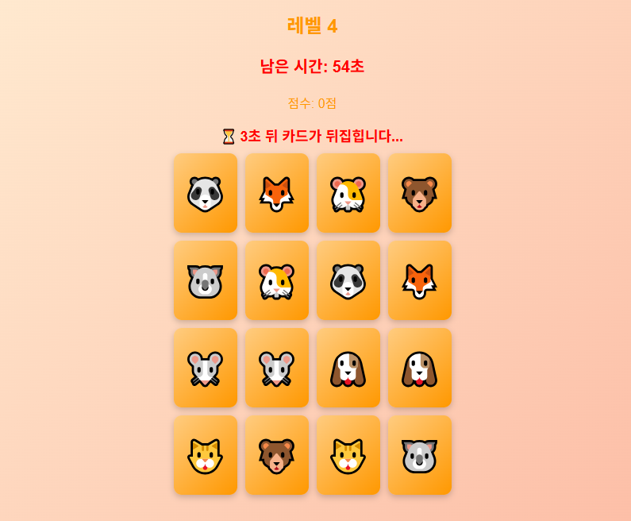

# Card-Matching-Game

## 프로젝트 소개

카드 짝맞추기 게임은 기억력을 테스트하는 간단한 게임으로 화면에 표시된 카드를 뒤집어 그림을 맞추는 게임. 점수를 획득하며 레벨이 올라갈수록 난이도가 증가.  
<br>
***[카드짝맞추기게임 하러가기 Click!](https://carpe-horas.github.io/Card-Matching-Game/)***

  

<br>

## 주요 기능

- 카드 짝맞추기 : 같은 그림의 카드 두 장을 맞추면 유지됨  
- 레벨 증가 시스템 : 모든 카드를 맞추면 다음 레벨로 이동 (난이도 상승)  
- 시간 제한 : 일정 시간이 지나면 게임 종료  
- 점수 시스템 : 카드 한 쌍을 맞출 때마다 점수 증가  
<br>

## 사용된 로직 및 알고리즘
1. 카드 배치 및 섞기 - Fisher-Yates Shuffle 알고리즘  
- 카드의 위치를 랜덤으로 섞기 위해 Fisher-Yates Shuffle을 사용
- 카드 배열 생성 후 무작위로 섞은 후, 현재 위치의 카드와 무작위로 선택된 카드의 위치를 교환하는 방식으로 동작
- 섞인 카드 배열을 이용해 게임 보드에 배치

2. 카드 뒤집기 및 짝맞추기  
- 두 장의 카드를 선택하여 선택된 카드가 같은 값인지 비교 
- 같으면 유지, 다르면 일정 시간 후 자동으로 다시 뒤집음
- 비교하는 동안 추가 입력을 막기 위해 클릭 차단

3. 게임 진행 및 레벨 업  
- 모든 짝을 맞추면 levelUp
- 배열을 활용하여 레벨별 카드 개수 조정
- 6x8(48장) 이후에는 동일 크기로 고정

4. 타이머 및 게임 종료  
- 일정 시간마다 남은 시간을 감소시키는 타이머 실행
- 시간이 0이 되면 게임이 자동 종료되며 게임 종료 화면으로 이동

5. 점수 시스템  
- 맞춘 카드 한 쌍마다 10점 추가
- levelUp 시 현재 레벨과 남은 시간을 기준으로 추가 점수 적용  
<br>

## 기술 스택


  
<br>

## 폴더 구조

```
📂 카드 짝맞추기 게임
 ├── 📂 css
 ┃   ├─ 📄 game.css           # 게임 화면 스타일
 ┃   ├─ 📄 gameover.css       # 게임 종료 화면 스타일
 ┃   ┗─ 📄 index.css          # 메인 화면 스타일
 ├── 📂 js
 ┃   ┗─📄 game.js            # 게임 로직 및 동작 구현
 ├── 📂 pages
 ┃   ├─ 📄 game.html          # 게임 실행 화면
 ┃   ┗─📄 gameover.html      # 게임 종료 화면
 ├── 📄 index.html           # 메인 페이지 (게임 시작 화면)
 ┗── 📄 README.md           
```

